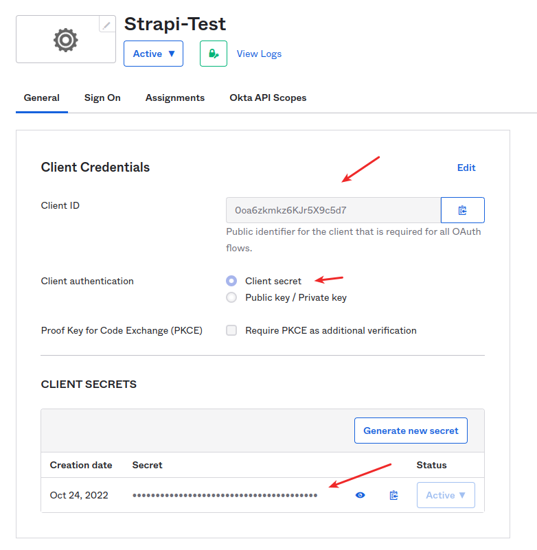
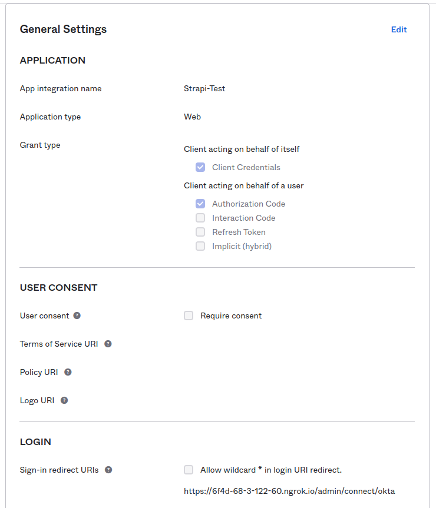
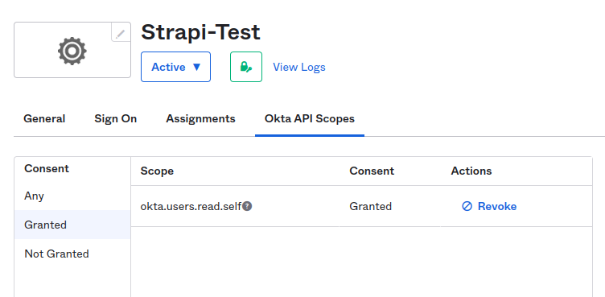
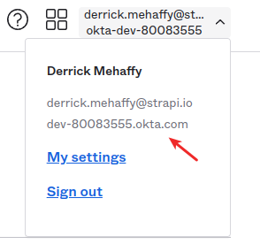

# Okta SSO configuration example

## Strapi configuration

Ensure you have set the following variables in your environment:

- `OKTA_CLIENT_ID`
- `OKTA_CLIENT_SECRET`
- `OKTA_DOMAIN`
- Your Strapi server url in your [config/server.js](config/server.js) file in this case the `URL` env variable

You will need the `passport-okta-oauth20` package and should configure your [config/admin.js](config/admin.js) file as per the [Strapi Documentation](https://docs.strapi.io/developer-docs/latest/setup-deployment-guides/configurations/optional/sso.html#okta). You may also need to modify your [config/middlewares.js](config/middlewares.js) file to add the CSP settings for `www.okta.com` if you want the logo to be pulled in remotely.

You will need the Strapi server URL to exist during build time when you rebuild the admin panel. If it doesn't exist then okta will not redirect properly.

## Okta configuration

Use the following settings to create your Okta application:

- Create a new application integration  using `OIDC - OpenID Connect` as the sign-in method
- Use `Web Application` as the application type
- Ensure you have something like `https://strapi.example.com/admin/connect/okta` as the sign-in redirect URL
- Ensure the user has access to the `okta.users.read.self` API scope (you can add more as needed but this is the only one required)

For an example see the following images:

#### Okta Client ID and Secret

#### Okta Application Settings

#### Okta Scopes

#### Okta Domain

